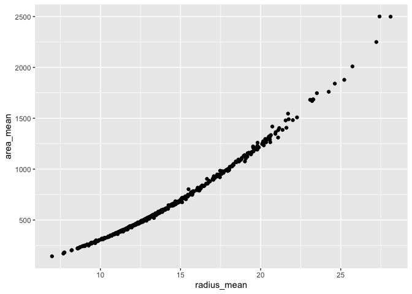
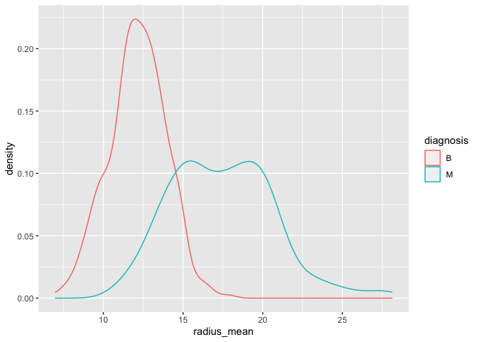
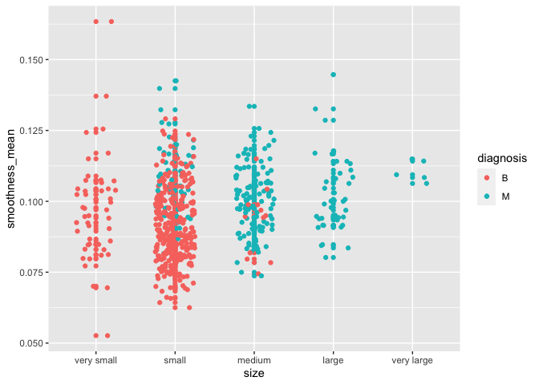
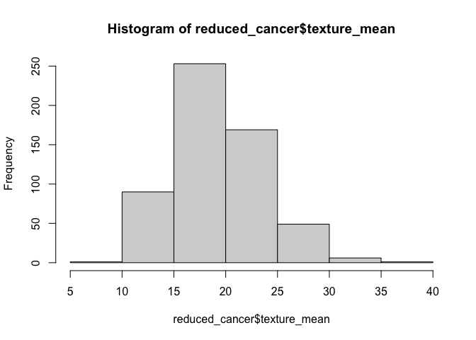
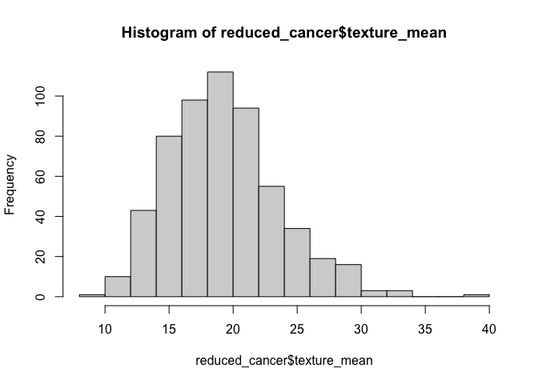
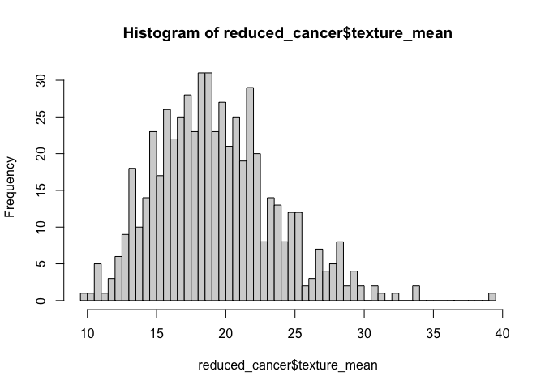
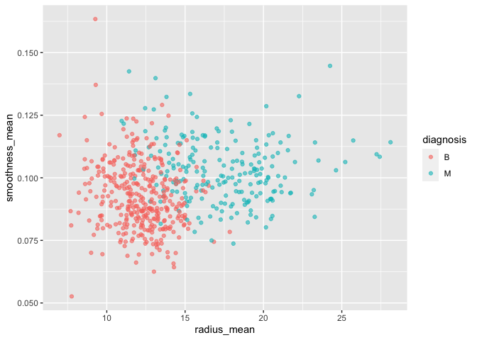
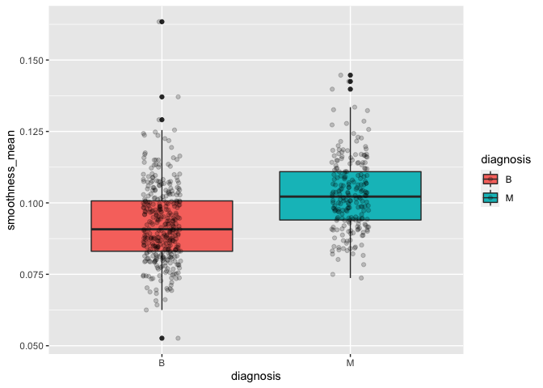

Mini Data-Analysis Deliverable 1
================

# Welcome to your (maybe) first-ever data analysis project!

And hopefully the first of many. Let’s get started:

1.  Install the [`datateachr`](https://github.com/UBC-MDS/datateachr)
    package by typing the following into your **R terminal**:

<!-- -->

    install.packages("devtools")
    devtools::install_github("UBC-MDS/datateachr")

2.  Load the packages below.

``` r
library(datateachr)
library(tidyverse)
```

    ## ── Attaching packages ─────────────────────────────────────── tidyverse 1.3.1 ──

    ## ✔ ggplot2 3.3.5     ✔ purrr   0.3.4
    ## ✔ tibble  3.1.6     ✔ dplyr   1.0.8
    ## ✔ tidyr   1.2.0     ✔ stringr 1.4.0
    ## ✔ readr   2.0.1     ✔ forcats 0.5.1

    ## ── Conflicts ────────────────────────────────────────── tidyverse_conflicts() ──
    ## ✖ dplyr::filter() masks stats::filter()
    ## ✖ dplyr::lag()    masks stats::lag()

3.  Make a repository in the <https://github.com/stat545ubc-2022>
    Organization. You will be working with this repository for the
    entire data analysis project. You can either make it public, or make
    it private and add the TA’s and Lucy as collaborators. A link to
    help you create a private repository is available on the
    \#collaborative-project Slack channel.

# Instructions

## For Both Milestones

-   Each milestone is worth 45 points. The number of points allocated to
    each task will be annotated within each deliverable. Tasks that are
    more challenging will often be allocated more points.

-   10 points will be allocated to the reproducibility, cleanliness, and
    coherence of the overall analysis. While the two milestones will be
    submitted as independent deliverables, the analysis itself is a
    continuum - think of it as two chapters to a story. Each chapter, or
    in this case, portion of your analysis, should be easily followed
    through by someone unfamiliar with the content.
    [Here](https://swcarpentry.github.io/r-novice-inflammation/06-best-practices-R/)
    is a good resource for what constitutes “good code”. Learning good
    coding practices early in your career will save you hassle later on!

## For Milestone 1

**To complete this milestone**, edit [this very `.Rmd`
file](https://raw.githubusercontent.com/UBC-STAT/stat545.stat.ubc.ca/master/content/mini-project/mini-project-1.Rmd)
directly. Fill in the sections that are tagged with
`<!--- start your work below --->`.

**To submit this milestone**, make sure to knit this `.Rmd` file to an
`.md` file by changing the YAML output settings from
`output: html_document` to `output: github_document`. Commit and push
all of your work to the mini-analysis GitHub repository you made
earlier, and tag a release on GitHub. Then, submit a link to your tagged
release on canvas.

**Points**: This milestone is worth 45 points: 43 for your analysis, 1
point for having your Milestone 1 document knit error-free, and 1 point
for tagging your release on Github.

# Learning Objectives

By the end of this milestone, you should:

-   Become familiar with your dataset of choosing
-   Select 4 questions that you would like to answer with your data
-   Generate a reproducible and clear report using R Markdown
-   Become familiar with manipulating and summarizing your data in
    tibbles using `dplyr`, with a research question in mind.

# Task 1: Choose your favorite dataset (10 points)

The `datateachr` package by Hayley Boyce and Jordan Bourak currently
composed of 7 semi-tidy datasets for educational purposes. Here is a
brief description of each dataset:

-   *apt_buildings*: Acquired courtesy of The City of Toronto’s Open
    Data Portal. It currently has 3455 rows and 37 columns.

-   *building_permits*: Acquired courtesy of The City of Vancouver’s
    Open Data Portal. It currently has 20680 rows and 14 columns.

-   *cancer_sample*: Acquired courtesy of UCI Machine Learning
    Repository. It currently has 569 rows and 32 columns.

-   *flow_sample*: Acquired courtesy of The Government of Canada’s
    Historical Hydrometric Database. It currently has 218 rows and 7
    columns.

-   *parking_meters*: Acquired courtesy of The City of Vancouver’s Open
    Data Portal. It currently has 10032 rows and 22 columns.

-   *steam_games*: Acquired courtesy of Kaggle. It currently has 40833
    rows and 21 columns.

-   *vancouver_trees*: Acquired courtesy of The City of Vancouver’s Open
    Data Portal. It currently has 146611 rows and 20 columns.

**Things to keep in mind**

-   We hope that this project will serve as practice for carrying our
    your own *independent* data analysis. Remember to comment your code,
    be explicit about what you are doing, and write notes in this
    markdown document when you feel that context is required. As you
    advance in the project, prompts and hints to do this will be
    diminished - it’ll be up to you!

-   Before choosing a dataset, you should always keep in mind **your
    goal**, or in other ways, *what you wish to achieve with this data*.
    This mini data-analysis project focuses on *data wrangling*,
    *tidying*, and *visualization*. In short, it’s a way for you to get
    your feet wet with exploring data on your own.

And that is exactly the first thing that you will do!

1.1 Out of the 7 datasets available in the `datateachr` package, choose
**4** that appeal to you based on their description. Write your choices
below:

**Note**: We encourage you to use the ones in the `datateachr` package,
but if you have a dataset that you’d really like to use, you can include
it here. But, please check with a member of the teaching team to see
whether the dataset is of appropriate complexity. Also, include a
**brief** description of the dataset here to help the teaching team
understand your data.

<!-------------------------- Start your work below ---------------------------->

1: *apt_buildings* 2: *cancer_sample* 3: *flow_sample* 4:
*parking_meters*

<!----------------------------------------------------------------------------->

1.2 One way to narrowing down your selection is to *explore* the
datasets. Use your knowledge of dplyr to find out at least *3*
attributes about each of these datasets (an attribute is something such
as number of rows, variables, class type…). The goal here is to have an
idea of *what the data looks like*.

*Hint:* This is one of those times when you should think about the
cleanliness of your analysis. I added a single code chunk for you below,
but do you want to use more than one? Would you like to write more
comments outside of the code chunk?

<!-------------------------- Start your work below ---------------------------->

``` r
### EXPLORE HERE ###

# number of rows
print(nrow(apt_buildings))
```

    ## [1] 3455

``` r
print(nrow(cancer_sample))
```

    ## [1] 569

``` r
print(nrow(flow_sample))
```

    ## [1] 218

``` r
print(nrow(parking_meters))
```

    ## [1] 10032

``` r
# number of variables
print(ncol(apt_buildings))
```

    ## [1] 37

``` r
print(ncol(cancer_sample))
```

    ## [1] 32

``` r
print(ncol(flow_sample))
```

    ## [1] 7

``` r
print(ncol(parking_meters))
```

    ## [1] 22

``` r
#head of data
head(apt_buildings)
```

    ## # A tibble: 6 × 37
    ##      id air_conditioning amenities   balconies barrier_free_acc… bike_parking   
    ##   <dbl> <chr>            <chr>       <chr>     <chr>             <chr>          
    ## 1 10359 NONE             Outdoor re… YES       YES               0 indoor parki…
    ## 2 10360 NONE             Outdoor po… YES       NO                0 indoor parki…
    ## 3 10361 NONE             <NA>        YES       NO                Not Available  
    ## 4 10362 NONE             <NA>        YES       YES               Not Available  
    ## 5 10363 NONE             <NA>        NO        NO                12 indoor park…
    ## 6 10364 NONE             <NA>        NO        NO                Not Available  
    ## # … with 31 more variables: exterior_fire_escape <chr>, fire_alarm <chr>,
    ## #   garbage_chutes <chr>, heating_type <chr>, intercom <chr>,
    ## #   laundry_room <chr>, locker_or_storage_room <chr>, no_of_elevators <dbl>,
    ## #   parking_type <chr>, pets_allowed <chr>, prop_management_company_name <chr>,
    ## #   property_type <chr>, rsn <dbl>, separate_gas_meters <chr>,
    ## #   separate_hydro_meters <chr>, separate_water_meters <chr>,
    ## #   site_address <chr>, sprinkler_system <chr>, visitor_parking <chr>, …

``` r
head(cancer_sample)
```

    ## # A tibble: 6 × 32
    ##         ID diagnosis radius_mean texture_mean perimeter_mean area_mean
    ##      <dbl> <chr>           <dbl>        <dbl>          <dbl>     <dbl>
    ## 1   842302 M                18.0         10.4          123.      1001 
    ## 2   842517 M                20.6         17.8          133.      1326 
    ## 3 84300903 M                19.7         21.2          130       1203 
    ## 4 84348301 M                11.4         20.4           77.6      386.
    ## 5 84358402 M                20.3         14.3          135.      1297 
    ## 6   843786 M                12.4         15.7           82.6      477.
    ## # … with 26 more variables: smoothness_mean <dbl>, compactness_mean <dbl>,
    ## #   concavity_mean <dbl>, concave_points_mean <dbl>, symmetry_mean <dbl>,
    ## #   fractal_dimension_mean <dbl>, radius_se <dbl>, texture_se <dbl>,
    ## #   perimeter_se <dbl>, area_se <dbl>, smoothness_se <dbl>,
    ## #   compactness_se <dbl>, concavity_se <dbl>, concave_points_se <dbl>,
    ## #   symmetry_se <dbl>, fractal_dimension_se <dbl>, radius_worst <dbl>,
    ## #   texture_worst <dbl>, perimeter_worst <dbl>, area_worst <dbl>, …

``` r
head(flow_sample)
```

    ## # A tibble: 6 × 7
    ##   station_id  year extreme_type month   day  flow sym  
    ##   <chr>      <dbl> <chr>        <dbl> <dbl> <dbl> <chr>
    ## 1 05BB001     1909 maximum          7     7   314 <NA> 
    ## 2 05BB001     1910 maximum          6    12   230 <NA> 
    ## 3 05BB001     1911 maximum          6    14   264 <NA> 
    ## 4 05BB001     1912 maximum          8    25   174 <NA> 
    ## 5 05BB001     1913 maximum          6    11   232 <NA> 
    ## 6 05BB001     1914 maximum          6    18   214 <NA>

``` r
head(parking_meters)
```

    ## # A tibble: 6 × 22
    ##   meter_head  r_mf_9a_6p r_mf_6p_10 r_sa_9a_6p r_sa_6p_10 r_su_9a_6p r_su_6p_10
    ##   <chr>       <chr>      <chr>      <chr>      <chr>      <chr>      <chr>     
    ## 1 Twin        $2.00      $4.00      $2.00      $4.00      $2.00      $4.00     
    ## 2 Pay Station $1.00      $1.00      $1.00      $1.00      $1.00      $1.00     
    ## 3 Twin        $1.00      $1.00      $1.00      $1.00      $1.00      $1.00     
    ## 4 Single      $1.00      $1.00      $1.00      $1.00      $1.00      $1.00     
    ## 5 Twin        $2.00      $1.00      $2.00      $1.00      $2.00      $1.00     
    ## 6 Twin        $2.00      $1.00      $2.00      $1.00      $2.00      $1.00     
    ## # … with 15 more variables: rate_misc <chr>, time_in_effect <chr>,
    ## #   t_mf_9a_6p <chr>, t_mf_6p_10 <chr>, t_sa_9a_6p <chr>, t_sa_6p_10 <chr>,
    ## #   t_su_9a_6p <chr>, t_su_6p_10 <chr>, time_misc <chr>, credit_card <chr>,
    ## #   pay_phone <chr>, longitude <dbl>, latitude <dbl>, geo_local_area <chr>,
    ## #   meter_id <chr>

<!----------------------------------------------------------------------------->

1.3 Now that you’ve explored the 4 datasets that you were initially most
interested in, let’s narrow it down to 2. What lead you to choose these
2? Briefly explain your choices below, and feel free to include any code
in your explanation.

<!-------------------------- Start your work below ---------------------------->

I am interested in *cancer_sample* and *flow_sample* because they sound
interesting to me and the data are mostly numerical.
<!----------------------------------------------------------------------------->

1.4 Time for the final decision! Going back to the beginning, it’s
important to have an *end goal* in mind. For example, if I had chosen
the `titanic` dataset for my project, I might’ve wanted to explore the
relationship between survival and other variables. Try to think of 1
research question that you would want to answer with each dataset. Note
them down below, and make your final choice based on what seems more
interesting to you!

<!-------------------------- Start your work below ---------------------------->

cancer_sample*d**i**a**g**n**o**s**i**s**f**l**o**w*<sub>*s*</sub>*a**m**p**l**e*extreme_type
With *cancer_sample*, I would like to create a model to explore
relationship and classify of the state of the tumor (M/B). With
*flow_sample*, I would like to explore relationship between variables
and flow.

My final desicion is the *cancer_sample* dataset.
<!----------------------------------------------------------------------------->

# Important note

Read Tasks 2 and 3 *fully* before starting to complete either of them.
Probably also a good point to grab a coffee to get ready for the fun
part!

This project is semi-guided, but meant to be *independent*. For this
reason, you will complete tasks 2 and 3 below (under the **START HERE**
mark) as if you were writing your own exploratory data analysis report,
and this guidance never existed! Feel free to add a brief introduction
section to your project, format the document with markdown syntax as you
deem appropriate, and structure the analysis as you deem appropriate.
Remember, marks will be awarded for completion of the 4 tasks, but 10
points of the whole project are allocated to a reproducible and clean
analysis. If you feel lost, you can find a sample data analysis
[here](https://www.kaggle.com/headsortails/tidy-titarnic) to have a
better idea. However, bear in mind that it is **just an example** and
you will not be required to have that level of complexity in your
project.

# Task 2: Exploring your dataset (15 points)

If we rewind and go back to the learning objectives, you’ll see that by
the end of this deliverable, you should have formulated *4* research
questions about your data that you may want to answer during your
project. However, it may be handy to do some more exploration on your
dataset of choice before creating these questions - by looking at the
data, you may get more ideas. **Before you start this task, read all
instructions carefully until you reach START HERE under Task 3**.

2.1 Complete *4 out of the following 8 exercises* to dive deeper into
your data. All datasets are different and therefore, not all of these
tasks may make sense for your data - which is why you should only answer
*4*. Use *dplyr* and *ggplot*.

1.  Plot the distribution of a numeric variable.
2.  Create a new variable based on other variables in your data (only if
    it makes sense)
3.  Investigate how many missing values there are per variable. Can you
    find a way to plot this?
4.  Explore the relationship between 2 variables in a plot.
5.  Filter observations in your data according to your own criteria.
    Think of what you’d like to explore - again, if this was the
    `titanic` dataset, I may want to narrow my search down to passengers
    born in a particular year…
6.  Use a boxplot to look at the frequency of different observations
    within a single variable. You can do this for more than one variable
    if you wish!
7.  Make a new tibble with a subset of your data, with variables and
    observations that you are interested in exploring.
8.  Use a density plot to explore any of your variables (that are
    suitable for this type of plot).

2.2 For each of the 4 exercises that you complete, provide a *brief
explanation* of why you chose that exercise in relation to your data (in
other words, why does it make sense to do that?), and sufficient
comments for a reader to understand your reasoning and code.

<!-------------------------- Start your work below ---------------------------->

1.  Plot the distribution of a numeric variable.

``` r
#using histogram to explore the distribution of flow
hist(cancer_sample$radius_mean)
```

<!-- -->

4.  Explore the relationship between 2 variables in a plot.

``` r
##create a scatterplot between radius_mean and area_mean to explore relationship
##assuming tumors are spherical in shape, there should be clear relationship between radius and area
ggplot(cancer_sample, aes(x = radius_mean, y = area_mean)) + 
        geom_point()
```

<!-- -->

7.  Make a new tibble with a subset of your data, with variables and
    observations that you are interested in exploring.

``` r
#I am interested in the mean columns that are somewhat uncorrelated (need further test)
reduced_cancer <- cancer_sample %>% select(ID, diagnosis, radius_mean, texture_mean, compactness_mean, concavity_mean, smoothness_mean, symmetry_mean)
reduced_cancer
```

    ## # A tibble: 569 × 8
    ##          ID diagnosis radius_mean texture_mean compactness_mean concavity_mean
    ##       <dbl> <chr>           <dbl>        <dbl>            <dbl>          <dbl>
    ##  1   842302 M                18.0         10.4           0.278          0.300 
    ##  2   842517 M                20.6         17.8           0.0786         0.0869
    ##  3 84300903 M                19.7         21.2           0.160          0.197 
    ##  4 84348301 M                11.4         20.4           0.284          0.241 
    ##  5 84358402 M                20.3         14.3           0.133          0.198 
    ##  6   843786 M                12.4         15.7           0.17           0.158 
    ##  7   844359 M                18.2         20.0           0.109          0.113 
    ##  8 84458202 M                13.7         20.8           0.164          0.0937
    ##  9   844981 M                13           21.8           0.193          0.186 
    ## 10 84501001 M                12.5         24.0           0.240          0.227 
    ## # … with 559 more rows, and 2 more variables: smoothness_mean <dbl>,
    ## #   symmetry_mean <dbl>

8.  Use a density plot to explore any of your variables (that are
    suitable for this type of plot).

``` r
# Change density plot line colors by groups (M vs B)
ggplot(cancer_sample, aes(x=radius_mean, color=diagnosis)) +
  geom_density()
```

<!-- -->

<!----------------------------------------------------------------------------->

# Task 3: Write your research questions (5 points)

So far, you have chosen a dataset and gotten familiar with it through
exploring the data. Now it’s time to figure out 4 research questions
that you would like to answer with your data! Write the 4 questions and
any additional comments at the end of this deliverable. These questions
are not necessarily set in stone - TAs will review them and give you
feedback; therefore, you may choose to pursue them as they are for the
rest of the project, or make modifications!

<!--- *****START HERE***** --->

1.  Do malignant and benign tumors have different sizes?
2.  Is there distribution difference between M vs B in each variable?
3.  Are there correlations between each variable?
4.  Should I keep every varible from reduced_cancer in my model?

<!----------------------------------------------------------------------------->

# Task 4: Process and summarize your data (13 points)

From Task 2, you should have an idea of the basic structure of your
dataset (e.g. number of rows and columns, class types, etc.). Here, we
will start investigating your data more in-depth using various data
manipulation functions.

### 1.1 (10 points)

Now, for each of your four research questions, choose one task from
options 1-4 (summarizing), and one other task from 4-8 (graphing). You
should have 2 tasks done for each research question (8 total). Make sure
it makes sense to do them! (e.g. don’t use a numerical variables for a
task that needs a categorical variable.). Comment on why each task helps
(or doesn’t!) answer the corresponding research question.

Ensure that the output of each operation is printed!

**Summarizing:**

1.  Compute the *range*, *mean*, and *two other summary statistics* of
    **one numerical variable** across the groups of **one categorical
    variable** from your data.
2.  Compute the number of observations for at least one of your
    categorical variables. Do not use the function `table()`!
3.  Create a categorical variable with 3 or more groups from an existing
    numerical variable. You can use this new variable in the other
    tasks! *An example: age in years into “child, teen, adult, senior”.*
4.  Based on two categorical variables, calculate two summary statistics
    of your choosing.

**Graphing:**

5.  Create a graph out of summarized variables that has at least two
    geom layers.
6.  Create a graph of your choosing, make one of the axes logarithmic,
    and format the axes labels so that they are “pretty” or easier to
    read.
7.  Make a graph where it makes sense to customize the alpha
    transparency.
8.  Create 3 histograms out of summarized variables, with each histogram
    having different sized bins. Pick the “best” one and explain why it
    is the best.

Make sure it’s clear what research question you are doing each operation
for!

<!------------------------- Start your work below ----------------------------->

##### 1. What is the distribution for radius?

``` r
#create categorical variables based on radius (size)
reduced_cancer$size <- cut(reduced_cancer$radius_mean,
                       breaks=c(0, 10, 15, 20, 25, 30),
                       labels=c('very small', 'small', 'medium', 'large', 'very large'))
head(reduced_cancer$size)
```

    ## [1] medium large  medium small  large  small 
    ## Levels: very small small medium large very large

It helps to put sizes into categories for further comparison.

We introduced smoothness and diagnosis into the plot.

``` r
#plot size against smoothness, separated by diagnosis. jitter to see points better
ggplot(reduced_cancer, aes(x=size, y = smoothness_mean, color= diagnosis)) + 
  geom_point() +
  geom_jitter(width = 0.25)
```

<!-- -->

It does not seem to help with understanding the distribution of the
radius. However, we are able to see more malignent diagnosis in larger
sizes. And smoothness_mean has smaller variation in larger sizes.

##### 2. Is there distribution difference between M vs B in each variable?

We looked at the mean, standard deviation, median and range of mean
texture in malignant vs benign groups.

``` r
reduced_cancer %>%
  group_by(diagnosis) %>%
  summarise(mean = mean(texture_mean), sd = sd(texture_mean), median = median(texture_mean), range = max(texture_mean)-min(texture_mean))
```

    ## # A tibble: 2 × 5
    ##   diagnosis  mean    sd median range
    ##   <chr>     <dbl> <dbl>  <dbl> <dbl>
    ## 1 B          17.9  4.00   17.4  24.1
    ## 2 M          21.6  3.78   21.5  28.9

This gives a clear idea of the distribution of the texture based on
diagnosis such that the means are not significantly different between
groups. However, it is not as direct as visualization.

We plot histograms on mean texture with different bins to see the
difference.

``` r
hist(reduced_cancer$texture_mean, breaks = 5) 
```

<!-- -->

``` r
hist(reduced_cancer$texture_mean, breaks = 20) 
```

<!-- -->

``` r
hist(reduced_cancer$texture_mean, breaks = 100) 
```

<!-- -->

The histogram with 20 bins is the best because it shows clear changes of
the distribution (and maybe an outlier as well) without overplotting.
This helps me see the distribution of texture variable.

##### 3. Are there correlations between each variable?

Based on the plot from Question 1, we see a decrease in variability in
smoothness as size gets larger. We want to do more analysis to
consolidate this finding.  
We looked at the mean, standard deviation, median and range of mean
smoothness in different sizes.

``` r
reduced_cancer %>%
  group_by(size) %>%
  summarise(mean = mean(smoothness_mean), sd = sd(smoothness_mean), median = median(smoothness_mean), range = max(smoothness_mean)-min(smoothness_mean))
```

    ## # A tibble: 5 × 5
    ##   size         mean      sd median  range
    ##   <fct>       <dbl>   <dbl>  <dbl>  <dbl>
    ## 1 very small 0.0971 0.0183  0.0970 0.111 
    ## 2 small      0.0941 0.0138  0.0928 0.0800
    ## 3 medium     0.0997 0.0118  0.0989 0.0598
    ## 4 large      0.103  0.0137  0.100  0.0645
    ## 5 very large 0.111  0.00375 0.109  0.0086

This is not very helpful. We are not able to tell if the summary
statistics are significantly different between each group.

We also want to construct a scatterplot with radius on the x axis and
smoothness on y axis, we change the alpha transparency so that we can
see the overlapping points clearer.

``` r
ggplot(reduced_cancer, aes(x = radius_mean, y = smoothness_mean, color = diagnosis))+
  geom_point(alpha = 0.6)
```

<!-- -->

We see a somewhat decrease in variation with larger x. However, no clear
relationship was found.

##### 4. Should I keep every varible from reduced_cancer in my model?

To have a better idea of the data and to avoid bias, we wnat to count
how many data are in each group separated by diagnosis.

``` r
reduced_cancer %>% count(diagnosis)
```

    ## # A tibble: 2 × 2
    ##   diagnosis     n
    ##   <chr>     <int>
    ## 1 B           357
    ## 2 M           212

This helps with answering the question because the number of M vs B is
not drastically different, so we can proceed with further analysis.

From the plot in Question 3, we don’t see a clear relationhsip between
diagnosis and smoothness. So in this part, I am plotting 2 boxplots side
by side, with scatter overlay (lower the transparacy of scatterplot to
see better).

``` r
cancer_sample %>% 
  ggplot(aes(x=diagnosis,y=smoothness_mean, fill=diagnosis)) +
  geom_boxplot() + geom_jitter(width=0.1,alpha=0.2)
```

<!-- -->

Since the boxes overlap each other, we don’t see a distinction in
smoothness based on diagnosis. This helps with answering the question as
I plan to not include smoothness in the model.

<!----------------------------------------------------------------------------->

### 1.2 (3 points)

Based on the operations that you’ve completed, how much closer are you
to answering your research questions? Think about what aspects of your
research questions remain unclear. Can your research questions be
refined, now that you’ve investigated your data a bit more? Which
research questions are yielding interesting results?

<!-------------------------- Start your work below ---------------------------->

Based on the questions above, we are able to gain sufficient idea of the
nature of the data. We are also able to rule out potential biases. The
research questions can be refined and be more tailored to variable
selection and correlation testing in the future. The last question is
yielding interesting result because we are able to find that smoothness
does not have too much to do with diagnosis.
<!----------------------------------------------------------------------------->

### Attribution

Thanks to Icíar Fernández Boyano for mostly putting this together, and
Vincenzo Coia for launching.
